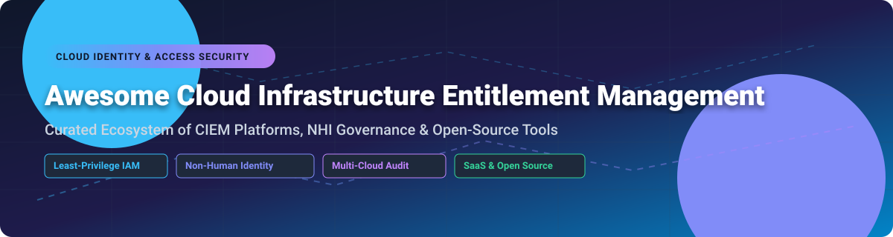

# Awesome Cloud Infrastructure Entitlement Management (CIEM) 🛡️⚡

  
  
  
  
  

## 🌐 Top Cloud Infrastructure Entitlement Management (CIEM) Platforms & Tools Ecosystem

**A Curated List of Enterprise SaaS Platforms & Open-Source GitHub Projects**  
*Focused on Multi-Cloud Permissions Analysis, Least-Privilege Automation, Identity Risk & Non-Human Identity (NHI) Governance across AWS, Azure, and GCP.*  

**Last updated: September 2026** 📅

---

### 🚀 Overview & Search Keywords
Cloud Infrastructure Entitlement Management (**CIEM**) empowers cloud security architects, IAM engineers, and SOC teams to discover unused permissions, enforce Zero Trust least-privilege policies, map privilege escalation routes, and govern non-human identities (service accounts, API keys, OAuth tokens, AI agents).

*Keywords: Cloud Infrastructure Entitlement Management, CIEM, Cloud Security, IAM Least Privilege, Non-Human Identity Governance, Identity Threat Detection & Response (ITDR), Multi-Cloud Access Graph, AWS IAM Analysis, Azure Role Entitlements, GCP IAM Governance.*

---

## 📑 Table of Contents
- [📊 Market Overview & Ecosystem Size](#-market-overview--ecosystem-size)
- [🏢 SaaS & Commercial Hosted Platforms](#-saas--commercial-hosted-platforms)
- [🔓 Open-Source GitHub Projects](#-open-source-github-projects)
- [🤝 How to Contribute](#-how-to-contribute)
- [⚠️ Disclaimer](#%EF%B8%8F-disclaimer)
- [☕ Support & Sponsorship](#-support--sponsorship)
- [📈 Star History](#-star-history)

---

## 📊 Market Overview & Ecosystem Size

> [!NOTE]
> The Cloud Infrastructure Entitlement Management (CIEM) sector is estimated at **$1.8 Billion** in 2026 and is projected to grow to **$4.5+ Billion** by 2030 (CAGR ~25%). The market is **moderately fragmented**, undergoing consolidation as major CNAPP leaders (Palo Alto Networks, Tenable, Cisco, Okta) acquire dedicated pioneers (Ermetic, Astrix, Permiso) to integrate identity graph capabilities alongside standalone specialized governance providers.

---

## 🏢 SaaS & Commercial Hosted Platforms

*Below is a detailed comparison of top commercial CIEM, Identity Governance, and Non-Human Identity (NHI) security platforms, sorted by enterprise valuation / estimated company scale (descending).*

| SaaS Platform 🚀 | Market Scale / Valuation 💰 | Starting Pricing 🏷️ | Free Tier / Trial Limits 🎁 | Key Security & Governance Features 🔑 |
| :--- | :--- | :--- | :--- | :--- |
| **[Palo Alto Prisma Cloud](https://www.paloaltonetworks.com/prisma/cloud)** | **$110 Billion+** (Public: PANW) | Starting from ~$90/credit/year (min tier ~100 credits, ~$9,000/yr) | 30-day full feature free trial (up to 100 cloud resources) | Enterprise CNAPP platform with GigaOm Leader CIEM module, AWS IAM Identity Center graph analysis, and multi-cloud permission mapping. |
| **[Microsoft Entra Permissions Management](https://learn.microsoft.com/entra/permissions-management/)** | **$3.1 Trillion+** (Public: MSFT) | $10.40 per resource per month ($124.80/resource/year) | 90-day free trial (up to 100 resources across Azure, AWS, and GCP) | Comprehensive Zero Trust discovery, right-sizing, and continuous monitoring of human and workload identity entitlements. |
| **[Tenable CIEM / Ermetic](https://www.tenable.com/)** | **$5.2 Billion** (Public: TENB) | Starting from ~$15,000/year base platform subscription | 30-day full access free trial for AWS, Azure, and GCP workloads | Best-in-class dedicated CIEM (acquired Ermetic) providing granular permissions analysis, automated remediations, and JIT access. |
| **[Axonius](https://www.axonius.com/)** | **$2.6 Billion** (Private valuation) | Starting from ~$15,000/year base license | 14-day free trial (full enterprise asset & identity coverage) | Dynamic identity governance connecting human, NHI, SaaS, and cloud identities with policy-driven automated enforcement workflows. |
| **[Veza](https://veza.com/)** | **$700 Million+** (Private valuation) | Starting from ~$25,000/year platform subscription | 14-day guided proof-of-concept trial (up to 5 cloud connectors) | Access Graph engine mapping identities across IdPs, cloud, and databases with advanced Non-Human Identity (NHI) governance. |
| **[Grip Security](https://www.grip.security/)** | **$350 Million+** (Private valuation) | Starting from ~$12,000/year enterprise base | 14-day free discovery assessment (shadow SaaS & OAuth grant audit) | SaaS Identity Risk Management (SIRM) control plane with no-code offboarding and automated GenAI/OAuth risk mitigation. |
| **[Sonrai Security](https://sonraisecurity.com/)** | **$250 Million+** (Private valuation) | Starting from ~$10,000/year cloud environment tier | 14-day free trial (AWS Organization permissions audit) | Cloud Permissions Firewall & ChatOps JIT permissions; proven 100% least-privilege enforcement across 60+ AWS accounts in days. |
| **[ConductorOne](https://www.conductorone.com/)** | **$200 Million+** (Private valuation) | Starting from $6 per user/month ($72/user/year) | 30-day free trial (unlimited identity connectors and JIT requests) | Autonomous Identity Security platform for humans & AI agents with policy-as-code enforcement and Model Context Protocol (MCP) governance. |
| **[Astrix Security](https://astrix.security/)** | **Acquired by Cisco** (May 2026, $85M+ raised) | Enterprise custom quote (starts ~$15,000/yr post-acquisition) | 14-day free NHI risk assessment (discovers API keys, OAuth, service accounts) | Pioneer in Non-Human Identity (NHI) and AI agent security, protecting secret tokens, OAuth apps, and service accounts from provisioning to retirement. |
| **[Permiso Security](https://permiso.io/)** | **Acquired by Okta** (Aug 2026, Series A raised) | Enterprise custom quote (starts ~$18,000/yr post-acquisition) | 14-day free identity threat detection trial | Identity Threat Detection & Response (ITDR) analyzing 2,500+ signals across 70+ identity providers for runtime overprivilege and agentic risk. |
| **[Entitle](https://www.entitle.io/)** | **$80 Million+** (Private valuation) | Starting from $4 per user/month ($48/user/year) | 14-day free trial (up to 50 active temporary access requests) | Fine-grained Just-In-Time (JIT) access engine reducing elevated access by 91% with auto-revocation and ticket system integrations. |
| **[AuthZed Enterprise](https://authzed.com/)** | **$30 Million+** (Private valuation) | Enterprise Cloud from $500/month ($6,000/year) | Developer Free Tier (forever free up to 1M permission checks/month) | Commercial enterprise platform powered by open-source SpiceDB, featuring SQL permission checks and fine-grained relationship-based access control. |

---

## 🔓 Open-Source GitHub Projects

*Below is a curated collection of active open-source repositories for self-hosted CIEM, cloud policy analysis, privilege escalation detection, and infrastructure graphing, sorted by GitHub Star Count (descending).* 🌟

| Project Name 🛠️ | GitHub Star Count ⭐ | Primary CIEM Category 🏷️ | Core Capabilities & Description 📝 |
| :--- | :--- | :--- | :--- |
| **[Cloud Custodian](https://github.com/cloud-custodian/cloud-custodian)** |  | Policy-as-Code & Compliance 📜 | High-performance rules engine for real-time cloud security, identity governance, cost optimization, and IAM resource cleanup across AWS, Azure, and GCP. |
| **[Prowler](https://github.com/prowler-cloud/prowler)** |  | Multi-Cloud CIEM & Security Audit ⚡ | Broadest open-source multi-cloud security assessment tool covering 65% of AWS IAM privilege escalation paths across AWS, Azure, GCP, and Kubernetes. |
| **[CloudQuery](https://github.com/cloudquery/cloudquery)** |  | SQL Data Sync & Entitlement Analysis 🗄️ | High-speed data movement framework extracting multi-cloud infrastructure & identity configurations into PostgreSQL/Snowflake for relational SQL entitlement queries. |
| **[Cloudsplaining](https://github.com/salesforce/cloudsplaining)** |  | AWS IAM Policy Risk Analysis 🔍 | Parses AWS IAM policies to detect wildcard permissions, resource exposure, and privilege escalation vulnerabilities with HTML risk reports. |
| **[policy_sentry](https://github.com/salesforce/policy_sentry)** |  | Preventative Policy Generation 📝 | Declares security requirements in clean YAML templates to automatically generate least-privilege AWS IAM policies without dangerous wildcards. |
| **[PMapper (Principal Mapper)](https://github.com/nccgroup/PMapper)** |  | Privilege Escalation Graph Analysis 🕸️ | Graph-based pathfinding engine simulating AWS IAM authorization decisions and trust relationships to uncover hidden privilege escalation routes. |
| **[IAMbic](https://github.com/noqdev/iambic)** |  | Multi-Cloud IAM-as-Code & GitOps 🔄 | Bi-directional GitOps framework managing IAM policies across AWS, Okta, Azure AD, and Google Workspace via version-controlled YAML files. |
| **[Awspx](https://github.com/ReversecLabs/awspx)** |  | Graph Visualization & Attack Path 🎯 | Graph-based AWS resource and identity visualizer powered by Neo4j to compute dynamic attack paths and privilege boundaries. |
| **[Cartography](https://github.com/cartography-cncf/cartography)** |  | Infrastructure & Identity Graphing 🌐 | CNCF open-source platform syncing multi-cloud assets and permissions into Neo4j for cross-domain identity relationship analysis. |

---

### 💡 Recommended Open-Source Architecture Flow
Security engineering teams building an internal CIEM pipeline can implement the following staged workflow:
1. **Scope & Audit**: Run **Prowler** for multi-cloud baseline checks and **Cloudsplaining** for AWS IAM risk report generation.
2. **Escalation Path Finding**: Execute **PMapper** and **Awspx** to calculate structural privilege escalation paths in graph models.
3. **Continuous Data Ingestion**: Deploy **CloudQuery** or **Cartography** to store identity relationships in SQL or Neo4j.
4. **Preventative Least Privilege**: Integrate **policy_sentry** into CI/CD pipelines and **IAMbic** for bi-directional GitOps identity management.

---

## 🤝 How to Contribute

Contributions are warmly welcomed! 💖 Please follow these steps to add or update projects:

1. **Fork** this repository.
2. Update `README.md` following the tabular markdown format.
3. Ensure all links are factual and descriptions highlight primary entitlement/identity features.
4. Submit a **Pull Request (PR)** with a clear title.

Please check out our list of awesome resources at [Awesome-Awesome-Awesome](https://github.com/ishandutta2007/Awesome-Awesome-Awesome)!

---

## ⚠️ Disclaimer

- This curated list is maintained by the community for informational and educational purposes.
- CIEM tools inspect sensitive production identity settings; ensure strict role-based controls when installing scanning engines.
- **Open-source vs SaaS**: While open-source tools excel at discovery and policy generation, enterprise SaaS platforms (Palo Alto, Tenable/Ermetic, Veza, Grip, Sonrai) provide automated Just-In-Time (JIT) access, user approval portals, and turnkey multi-cloud governance.

---

## 💖 Support & Sponsorship

If you find this repository helpful for your cloud security architecture or IAM governance initiatives, please consider supporting the project!

- 🌟 **Star this repository** to help others discover it!
- 🔀 **Fork it** to contribute new CIEM tools.
- 📢 **Share it** with your cloud security and DevOps teams!
- ☕ **Buy me a coffee / Sponsor**: [GitHub Sponsor Dashboard](https://github.com/sponsors/ishandutta2007)

Thank you to all contributors and cloud security engineers working toward least-privileged cloud environments! 🙌

---

## 📈 Star History

---

**Made with ❤️ for Cloud Security Architects, IAM Engineers, and DevSecOps Teams.**
